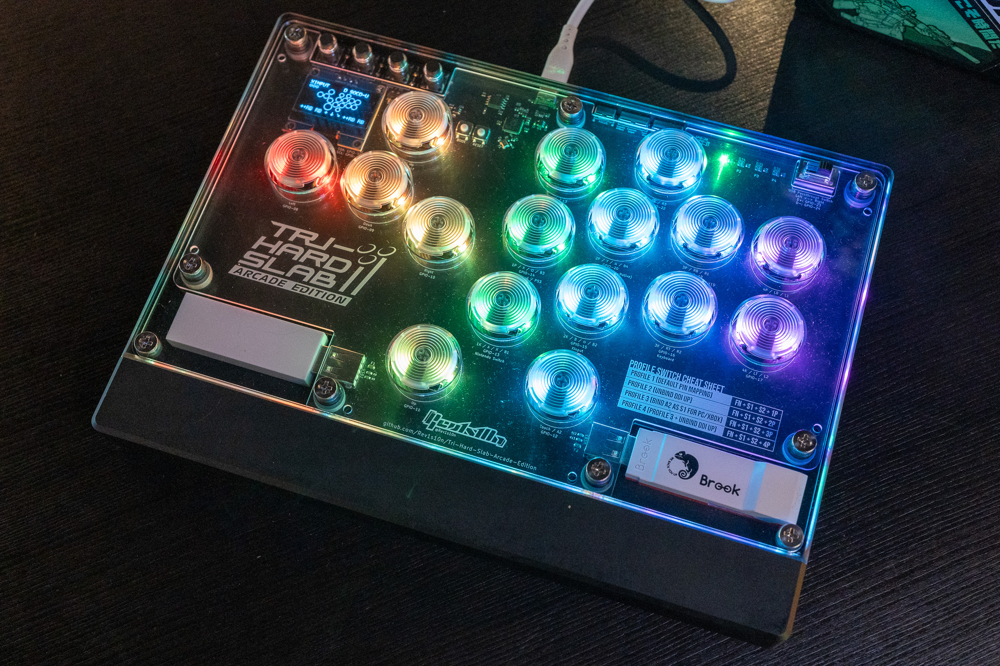
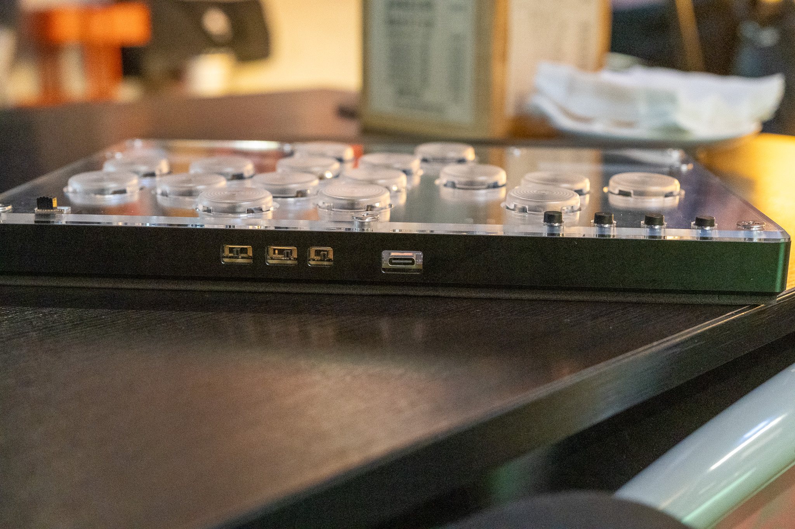

# Tri-Hard Slab: Arcade Edition
## **English | [繁體中文](README_zh-TW.md)**
A follow up from my previous [build](https://github.com/Rev1s10n/Tri-Hard-slab-v2), powered by [GP2040-CE](https://gp2040-ce.info/) firmware (v.0.7.10) with custom 16 buttons layout. 
This time it's made with Cherry MX switches instead of Kailh Choc switches, and CNC aluminum case with acrylic top layer for art insert.

**I would suggest not build this yourself at this momemnt as there's some design flaws, which makes it really difficult to assemble** 
**A new case design might come in the future**

## Key features and specs
- Dimensions: 270x200x24.1mm (including custom laser cut foampad)
- Weights: 1.3 kg
- Single CNC alumium case with laser cut acrylic sheet top panel and CNC polycarbonate mounting plate.
- Main key switches: any Cherry MX style switches, with hot swap sockets and Punk Workshop's key caps (25.5mm)
- Double RGB LED per key, and 4 RGB LEDs for player number indication.
- 2 USB Type-A connectors for passthrough devices, with slide switches to choose which one to activate.
- 1.3 inches OLED display.
- 3 slide switches on the top side for focus, SOCD and DP / LS / RS switch.
- Additional up button for general gaming purpose, and function key for quick profile swap.

Close up photos and feature explain:

_Fully redesigned circuit board with custom layout for my own comfort, passthrough device is now within the enclosure_

_1 additional tactile switch for function key, and custom display layout_

_Passthrough device can be selected with this slide switch_

_This time these switches is on the top side_

## Production files
Simply download all production files via Hardware files folder, and utilize services like JLCPCB (which is what I did in this case) to order the board. 
The board need standard PCBA for certain components. JLCPCB might told you there's some error (2 pins on 1 pad) but it's intended, and they'll make the board nevertheless. 
As for the case and acrylics / PC sheet, there's a step file for CNC aluminum case, 2 dxf files for laser cut acrylic, 1 dxf for CNC PC mounting plate.

## Source files
The Tri-Hard Slab AE is made with Autodesk Fusion 360 and KiCad 7.0. 
Everything is under Source files, include a rough Fusion 360 sketch which is the base of all laser-cut dxf files, step file and for KiCad to align things up.

## Assemble and settings
This is a bit tricky compare to original build. 
Here's some additional things you need to complete this build:
- Cherry MX switches, or any MX compatible switches, I use Cherry MX Black in this case.
- 16 Kailh MX hot swap socket (PG1511).
- 1.3 inches OLED display, make sure the pin order and set the slide switch accordingly.
- 9 M6 sex bolt / Chicago screws, with additional sink head screws
- Tons of hard and soft PVC washer (M6 sizes, 1mm thick) and NBR o-ring (6*2mm) for spacing.
- Custom laser cut EVA foams

There's a custom firmware with custom button layout for OLED display, and here's the GPIO pin mapping for reference:
|Keys|GPIO|
|-|-|
|Up|11|
|Down|9|
|Left|8|
|Right|10|
|B1/1K/A/Circle|13|
|B2/2K/B/Cross|15|
|B3/1P/X/Square|14|
|B4/2P/Y/Triangle|20|
|L1/4P/LB|18|
|R1/3P/RB|19|
|L2/4K/LT|17|
|R2/3K/RT|16|
|S1/Select/Back|1|
|S2/Start|3|
|L3/LS|21|
|R3/RS|22|
|A1/Home/Guide|2|
|A2/Touch|12|
|Function|0|
|Dual Direction Up|7|

Additional GPIO pin mapping and LED index for other features:
|Features|GPIO and index|
|-|-|
|RGB LED Data Pin|6|
|Player LEDs|starting from 32 to 35|
|Display SDA|4|
|Display SCL|5|
|Joystick Selection Slider Pin 1|26|
|Joystick Selection Slider Pin 2|25|
|SOCD Cleaning Mode Selection Slider Pin 1|28|
|SOCD Cleaning Mode Selection Slider Pin 2|27|
|PS Passthrough D+|23|
|PS Passthrough D-|24|
|Focus Mode Pin|29|

After load the setting file, there's 4 different profiles and there's shortcut combination to switch to any profile:
|Profile|Key combination|
|-|-|
|Profile 1 (Default pin mapping)|FN + S1 + S2 + 1P|
|Profile 2 (Unbind DDI Up)|FN + S1 + S2 + 2P|
|Profile 3 (Bind A2 as S1 for PC/Xbox)|FN + S1 + S2 + 3P|
|Profile 4 (Profile 3 + Unbind DDI Up)|FN + S1 + S2 + 4P|

## Custom artwork

You can download the PSD file and dxf drawing reference in Custom artwork template folder for top panel. 
Print it out and insert the artwork between 02 and 03 acrylic layers.

## Attribution
You're free to use this design as long as you credit to this page. 
[Licensed under CC BY 4.0](https://creativecommons.org/licenses/by/4.0/)
