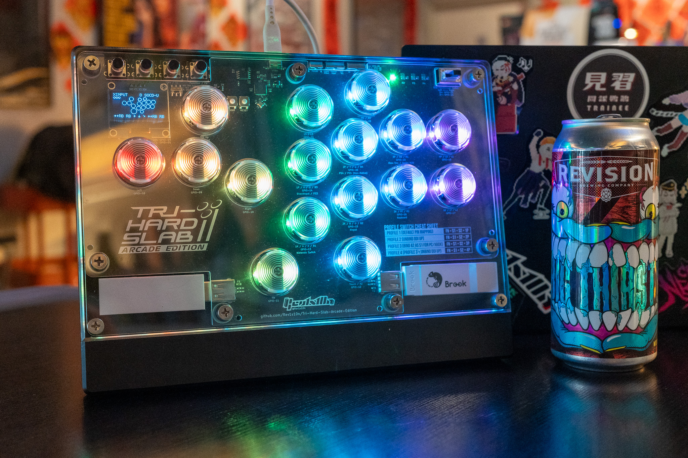
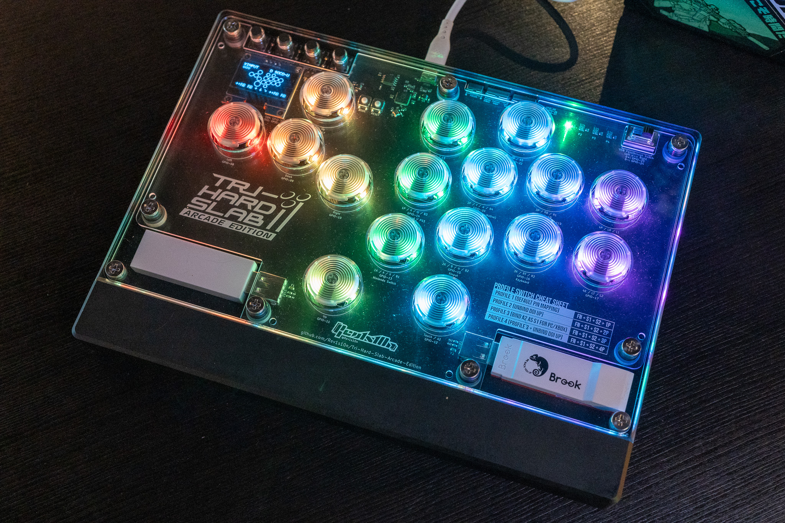
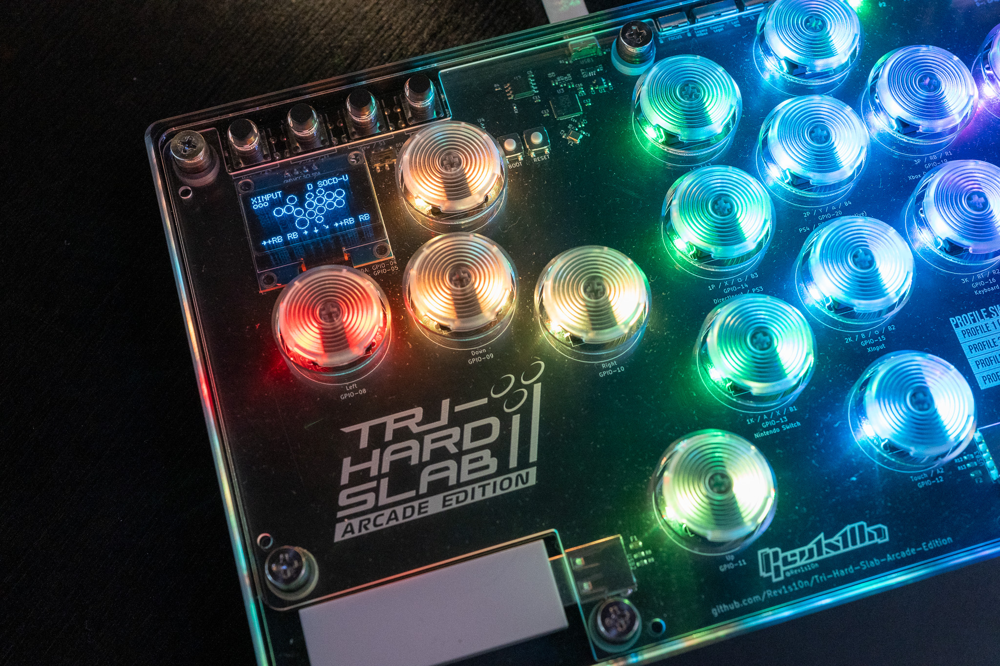
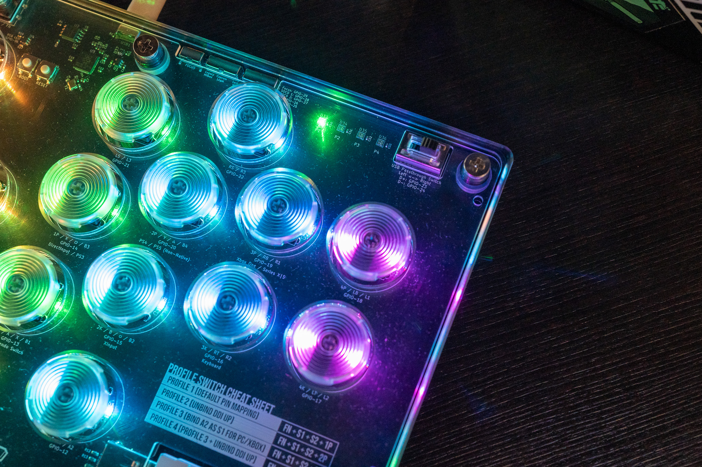
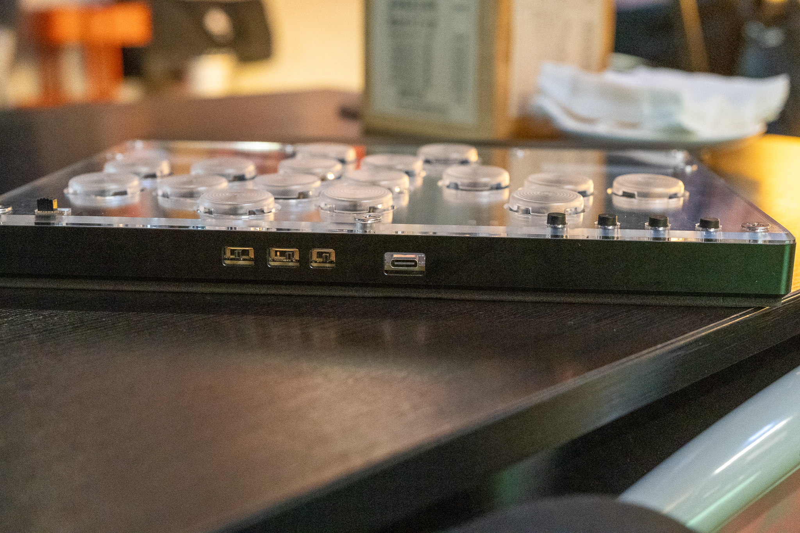

# Tri-Hard Slab: Arcade Edition
## **[English](README.md) | 繁體中文**
這是前一個[專案](https://github.com/Rev1s10n/Tri-Hard-slab-v2)的更新，使用 [GP2040-CE](https://gp2040-ce.info/) 0.7.7 版韌體，客製 16 鍵配置。 
改用 Cherry MX 軸而非原版的凱華矮軸，CNC 鋁框與壓克力面板可以嵌入面板圖。

**現階段由於有些設計缺陷導致組裝困難，不建議自行製作** 
**未來會設計新的外殼來改善**

## 主要功能與規格
- 尺寸：270x200x24.1mm（高度包含客製雷切泡棉墊）
- 重量：1.3 kg
- 一體式 CNC 鋁框，雷切壓克力面板與 CNC PC 定位板。
- 主要按鍵軸體：任何 Cherry MX 相容軸，搭配熱插拔軸作與 PunkWorkshop 的鍵帽（25.5mm）。
- 每個按鍵有 2 個 RGB LED，以及 4 個 RGB LED 顯示玩家號碼。
- 2 個 USB Type-A 供通過驗證使用，可以用滑動開關來切換使用的裝置。
- 1.3 吋 OLED 螢幕。
- 上方有 3 個滑動開關給專注模式（競技模式）、SOCD 模式與 LS / DP / RS 模式切換。
- 為了其他一般遊戲做了額外的上方向鍵，以及 FN 鍵供快捷切換設定檔。

各項功能的近照：

重新設計的電路板，鍵位依個人喜好調整過，通過驗證用的裝置現在直接放在殼內

多了一個輕觸開關做 FN 鍵，螢幕上的按鍵配置有另外客製

通過驗證裝置可以用這個滑動開關來切換

其他的滑動開關現在位於上方

## 生產用檔案
下載所有 Hardware files 資料夾中的檔案就能發給 PCB 廠商製作。我使用的依然是 JLCPCB。 
這張板子需要標準 PCBA 才能製作，JLCPCB 有可能在檢查檔案期間會跳錯誤（2 個針腳接在同一個 pad 上），但這是刻意的，他們最後還是會正常製作。 
外殼跟壓克力／PC 的部分，CNC 鋁框有一個 step 檔，2 個 dxf 供壓克力雷切，1 個 dxf 供 CNC PC 定位板。

## 原始檔
The Tri-Hard Slab AE 使用 Autodesk Fusion 360 跟 KiCad 7.0 製作。 
所有原始檔都在 Source files 資料夾內，包含 Fusion 360 的粗略草稿，所有的雷射切割跟 step 檔，以及匯入 KiCad 對齊零件的圖都出自於這裡。

## 組裝與設定
這跟上一個 build 比起來有些棘手。 
你需要許多額外的東西才能完成組裝：
- Cherry MX 軸，或是任何相容 MX 規格的軸體，我使用的是 Cherry MX 黑軸。
- 16 個凱華 MX 熱插拔座（PG1511）。
- 1.3 吋 OLED 螢幕，記得確認針腳順序並使用旁邊的滑動開關調整。
- 9 個 M6 對鎖螺絲，搭配額外的沉頭螺絲。
- 一大堆軟跟硬的 PVC 墊片（M6 尺寸，1mm 厚），跟 NBR 油封（6*2mm）間格用。
- 客製雷切 EVA 泡棉墊

客製的韌體有專屬的 OLED 螢幕按鍵配置，另外列出所有的 GPIO 按鍵對應：
|按鍵|GPIO|
|-|-|
|Up|11|
|Down|9|
|Left|8|
|Right|10|
|B1/1K/A/Circle|13|
|B2/2K/B/Cross|15|
|B3/1P/X/Square|14|
|B4/2P/Y/Triangle|20|
|L1/4P/LB|18|
|R1/3P/RB|19|
|L2/4K/LT|17|
|R2/3K/RT|16|
|S1/Select/Back|1|
|S2/Start|3|
|L3/LS|26|
|R3/RS|25|
|A1/Home/Guide|2|
|A2/Touch|12|
|Function|0|
|Dual Direction Up|7|

額外的 GPIO 對應，與 LED 索引編號：
|功能|GPIO and index|
|-|-|
|RGB LED Data Pin|6|
|Player LEDs|從 32 到 35|
|Display SDA|4|
|Display SCL|5|
|Joystick Selection Slider Pin 1|26|
|Joystick Selection Slider Pin 2|25|
|SOCD Cleaning Mode Selection Slider Pin 1|28|
|SOCD Cleaning Mode Selection Slider Pin 2|27|
|PS Passthrough D+|23|
|PS Passthrough D-|24|
|Focus Mode Pin|29|

載入備份的設定檔後，有 4 個按鍵設定檔可以用快捷鍵切換：
|設定檔|快捷鍵組合|
|-|-|
|設定檔 1（預設按鍵綁定）|FN + S1 + S2 + 1P|
|設定檔 2（解除 DDI Up 綁定）|FN + S1 + S2 + 2P|
|設定檔 3（在 PC / Xbox 使用時，將 A2 鍵改為 S1）|FN + S1 + S2 + 3P|
|設定檔 4（設定檔 3 + 解除 DDI Up 綁定）|FN + S1 + S2 + 4P|

## 客製面板圖

Custom artwork template 資料夾中有 PSD 跟 dxf 原檔參考。 
印出來後把圖片夾在 02 跟 03 的壓克力之間即可。

## 姓名標示
請自由使用，但需要註記來源自這個頁面。 
[採用 CC 姓名標示 4.0](https://creativecommons.org/licenses/by/4.0/)
